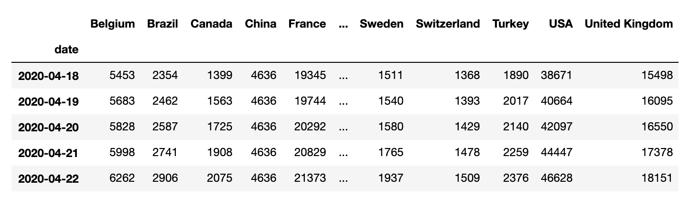

# Bar Chart Race

Make animated bar chart races with matplotlib.


## Installation

Install with `pip install bar-chart-race`

## Usage

Must begin with a pandas DataFrame containing 'wide' data where:

* Every row represents a single period of time
* Each column holds the value for a particular category
* The index contains the time component (optional)
  
The data below is an example of properly formatted data. It shows total deaths from COVID-19 for the highest 20 countries by date.



### Main function - `bar_chart_race`

Only one main function exists, **`bar_chart_race`** that saves the animation to disk. Here, we recreate the above video. All parameters are shown with their default value except for `title`.

```python
>>> import bar_chart_race as bcr
>>> df = bcr.load_dataset('covid19')
>>> bcr.bar_chart_race(
    df=df,
    filename='covid19_horiz_desc.mp4',
    orientation='h',
    sort='desc',
    label_bars=True,
    use_index=True,
    steps_per_period=10,
    period_length=500,
    cmap='dark24',
    title='COVID-19 Deaths by Country',
    bar_label_size=7,
    tick_label_size=7,
    period_label_size=16,
    fig=None)
```

### Save animation to disk or return HTML

Leave the `filename` parameter as `None` to return the animation as HTML. You can subsequently embed the animation into a Jupyter Notebook with the following.

```ipython
In [1]: bcr_html = bcr.bar_chart_race(df=df, filename=None)
In [2]: from IPython.display import HTML
In [3]: HTML(bcr_html)
```
