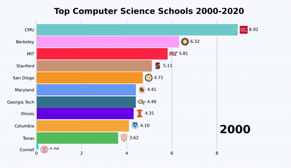

# Bar Chart Race

Make animated bar and line chart races in Python with matplotlib or plotly.

Original Repo (without icons) : [https://github.com/dexplo/bar_chart_race](https://github.com/dexplo/bar_chart_race)

Andres Berejnoi's Repo (with
icons) : [https://github.com/andresberejnoi/bar_chart_race](https://github.com/andresberejnoi/bar_chart_race)

---

## Top Computer Science Schools 2000 - 2020



---

## Installation

First Create a New Virtual Environment & Activate It:

```
pip install virtualenv
virtualenv venv
.\venv\Scripts\activate
```

Install `bar_chart_race` using `pip`:

```
pip install git+https://github.com/programiz/bar_chart_race.git@master
```

You also need to install
FFmpeg: [https://github.com/BtbN/FFmpeg-Builds/releases/](https://github.com/BtbN/FFmpeg-Builds/releases/)

---

## Usage

Create a file and use the `bar_chart_race` library as shown below:

```python
import bar_chart_race as bcr
import pandas as pd

df = pd.read_csv("data.csv", index_col="Date")

# replace empty values with 0
df.fillna(0.0, inplace=True)

# using the bar_chart_race package
bcr.bar_chart_race(
    # must be a DataFrame where each row represents a single period of time.
    df=df,

    # name of the video file
    filename="video.mp4",

    # specify location of image folder
    img_label_folder="bar_image_labels",

    # change the Figure properties
    fig_kwargs={
        'figsize': (26, 15),
        'dpi': 120,
        'facecolor': '#F8FAFF'
    },

    # orientation of the bar: h or v
    orientation="h",

    # sort the bar for each period
    sort="desc",

    # number of bars to display in each frame
    n_bars=10,

    # to fix the maximum value of the axis
    # fixed_max=True,

    # smoothness of the animation
    steps_per_period=45,

    # time period in ms for each row
    period_length=1500,

    # custom set of colors
    colors=[
        '#6ECBCE', '#FF2243', '#FFC33D', '#CE9673', '#FFA0FF', '#6501E5', '#F79522', '#699AF8', '#34718E', '#00DBCD',
        '#00A3FF', '#F8A737', '#56BD5B', '#D40CE5', '#6936F9', '#FF317B', '#0000F3', '#FFA0A0', '#31FF83', '#0556F3'
    ],

    # title and its styles
    title={'label': 'Programming Language Popularity 1990 - 2020',
           'size': 52,
           'weight': 'bold',
           'pad': 40
           },

    # adjust the position and style of the period label
    period_label={'x': .95, 'y': .15,
                  'ha': 'right',
                  'va': 'center',
                  'size': 72,
                  'weight': 'semibold'
                  },

    # style the bar label text
    bar_label_font={'size': 27},

    # style the labels in x and y axis
    tick_label_font={'size': 27},

    # adjust the style of bar
    # alpha is opacity of bar
    # ls - width of edge
    bar_kwargs={'alpha': .99, 'lw': 0},

    # adjust the bar label format
    bar_texttemplate='{x:.2f}',

    # adjust the period label format
    period_template='{x:.0f}',
)
```