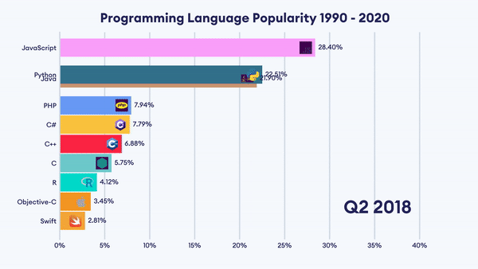

# Bar Chart Race

Make animated bar and line chart races in Python with matplotlib or plotly.

## Customized bar chart race for programming languages

## Bar Chart Race with Images For Bars
This is what this feature should accomplish. It is a little rough right now and not very generalizable.

## Usage/Customization

1. Use <code>customized_programiz</code> branch to customize the code. 
To install the branch using pip:
<pre>pip install git+https://github.com/Rhitabrat/bar_chart_race.git@customized_programiz</pre> 
To clone using git:
<pre>git clone -b customized_programiz https://github.com/Rhitabrat/bar_chart_race.git</pre>

2. Create a folder called <code>bar_image_labels</code> and store the icons with the exact names as the column names.
For example: if the name of a column is 'python', the icon name should be <code>python.png</code>.

3. Create a file and create the animation as shown below.
<pre>
import numpy as np
import pandas as pd
import bar_chart_race as bcr
import os
import matplotlib as mpl
from matplotlib import font_manager as fm

df = pd.read_csv("data/language-popularity.csv", index_col='Date')

# replace empty values with 0
df.fillna(0.0, inplace=True)

# plotting the graph
bcr.bar_chart_race(
    df=df.tail(30),
    filename='visualization/video.mp4',
    orientation='h',
    sort='desc',
    n_bars=10,
    fixed_order=False,
    fixed_max=False,
    steps_per_period=30, # smoothness
    interpolate_period=False,
    bar_size=.95,
    period_label={'x': .95, 'y': .15,
                  'ha': 'right',
                  'va': 'center',
                  'size': 72,
                  'weight': 'semibold'
                  },

    shared_fontdict={'family': 'Euclid Circular A',
                     'weight': 'medium', 'color': '#25265E'},

    perpendicular_bar_func=None,
    period_length=1500,     # time period in ms per data
    scale='linear',
    writer=None,
    fig=None,
    bar_kwargs={'alpha': .99, 'lw': 0},
    filter_column_colors=True,
    
    fig_kwargs={'figsize':(26.67, 15), 'dpi':144, 'facecolor': '#F8FAFF'} ,
    colors='brand_colors',
    
    title={'label': 'Programming Language Popularity 1990 - 2020',
            'size': 52,
            'weight': 'bold',
            # 'loc': 'right',
            'pad': 40},
    bar_label_font={'size':27},  # bar text size
    tick_label_font={'size':27}, # y-axis text size
    
    img_label_folder='bar_image_labels',
)
</pre>

## Official Documentation

Visit the [bar_chart_race official documentation](https://www.dexplo.org/bar_chart_race) for detailed usage instructions.