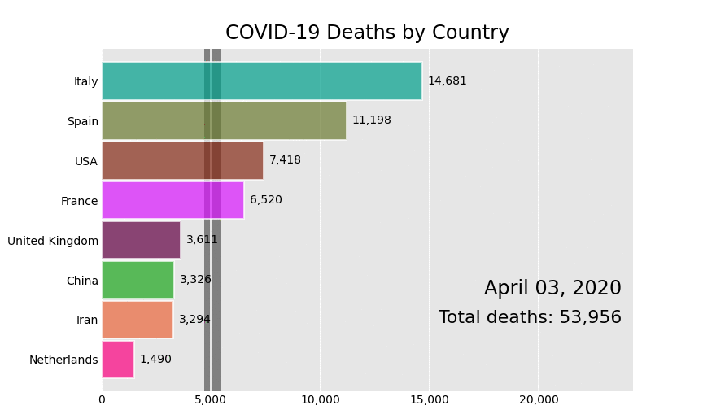
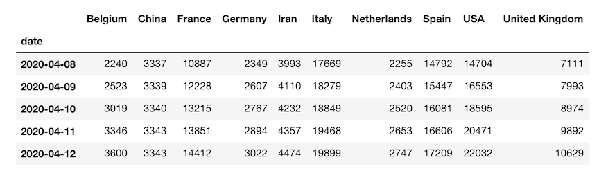

# Bar Chart Race

[](https://pypi.org/project/bar_chart_race)
[](LICENSE)

Make animated bar chart races in Python with matplotlib.



## Official Documentation

Visit the [bar_chart_race official documentation](https://www.dexplo.org/bar_chart_race) for detailed usage instructions.

## Installation

Install with either:

* `pip install bar_chart_race`
* `conda install -c conda-forge bar_chart_race`

## Quickstart

Must begin with a pandas DataFrame containing 'wide' data where:

* Every row represents a single period of time
* Each column holds the value for a particular category
* The index contains the time component (optional)
  
The data below is an example of properly formatted data. It shows total deaths from COVID-19 for several countries by date.



### Main function - `bar_chart_race`

There is one main function, **`bar_chart_race`**, which we use to recreate the above video. All parameters are shown with their default value except for `filename` and `title`.

```python
import bar_chart_race as bcr
df = bcr.load_dataset('covid19_tutorial')
bcr.bar_chart_race(
    df=df,
    filename='covid19_horiz.mp4',
    orientation='h',
    sort='desc',
    n_bars=6,
    fixed_order=False,
    fixed_max=True,
    steps_per_period=10,
    interpolate_period=False,
    label_bars=True,
    bar_size=.95,
    period_label={'x': .99, 'y': .25, 'ha': 'right', 'va': 'center'},
    period_fmt='%B %d, %Y',
    period_summary_func=lambda v, r: {'x': .99, 'y': .18,
                                      's': f'Total deaths: {v.nlargest(6).sum():,.0f}',
                                      'ha': 'right', 'size': 8, 'family': 'Courier New'},
    perpendicular_bar_func='median',
    period_length=500,
    figsize=(5, 3),
    dpi=144,
    cmap='dark24',
    title='COVID-19 Deaths by Country',
    title_size='',
    bar_label_size=7,
    tick_label_size=7,
    shared_fontdict={'family' : 'Helvetica', 'color' : '.1'},
    scale='linear',
    writer=None,
    fig=None,
    bar_kwargs={'alpha': .7},
    filter_column_colors=False)  
```

### Save animation to disk or return HTML

Leave the `filename` parameter as `None` to return the animation as HTML. You can subsequently embed the animation into a Jupyter Notebook with the following.

```python
bcr_html = bcr.bar_chart_race(df=df, filename=None)
from IPython.display import HTML
HTML(bcr_html)
```

### Customization

There are many options to customize the bar chart race to get the animation you desire. Below, we have an animation where the maximum x-value and order of the bars are set for the entire duration. A custom summary label and perpendicular bar of median is also added.

```python
def period_summary(values, ranks):
    top2 = values.nlargest(2)
    leader = top2.index[0]
    lead = top2.iloc[0] - top2.iloc[1]
    s = f'{leader} by {lead:.0f}'
    return {'s': s, 'x': .95, 'y': .07, 'ha': 'right', 'size': 8}

bcr.bar_chart_race(df_baseball, period_length=1000,
                   fixed_max=True, fixed_order=True, n_bars=10,
                   figsize=(5, 3), period_fmt='Season {x:,.0f}',
                   title='Top 10 Home Run Hitters by Season Played')
```

